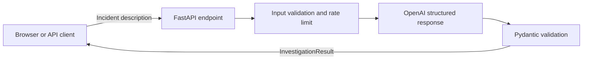

# AI Incident Investigation Platform

[](https://github.com/Lucas1114/ai-incident-platform/actions/workflows/ci.yml)

A publicly deployed FastAPI portfolio application that turns an incident
description into a concise, structured investigation brief using an OpenAI
model.

**[Try the live demo](https://ai-incident-platform-152544821369.australia-southeast1.run.app/)** ·
[API documentation](https://ai-incident-platform-152544821369.australia-southeast1.run.app/docs) ·
[Health check](https://ai-incident-platform-152544821369.australia-southeast1.run.app/health)

## What it demonstrates

- API design with FastAPI and Pydantic
- Schema-constrained LLM output instead of free-form text parsing
- Careful AI semantics: a leading hypothesis is not presented as a confirmed root cause
- A prompt that asks the model to restrict evidence to submitted observations
- One diagnostic next action requested from the model
- Public-cloud deployment with CI, secret management, rate limiting, and cost controls
- A responsive browser interface for demonstrating the complete workflow

## Example

Input:

```text
Checkout latency increased from 400 ms to 4.8 s after the 14:05 deployment.
Payment-provider calls are timing out, while catalog and authentication remain
healthy. Rolling back the release restored latency within six minutes.
```

The API returns this shape:

```json
{
  "summary": "Checkout latency increased following a deployment and recovered after rollback.",
  "severity": "high",
  "leading_hypothesis": "The 14:05 release may have caused slower or failing payment-provider calls.",
  "evidence": [
    "Checkout latency increased from 400 ms to 4.8 s after the deployment.",
    "Payment-provider calls timed out while catalog and authentication remained healthy.",
    "Latency recovered within six minutes of rollback."
  ],
  "recommended_next_action": "Compare payment integration changes in the rolled-back release with the previous version."
}
```

The exact wording varies by model response, while the response structure is
validated against the same Pydantic model used by the API.

## How it works



`POST /investigate` accepts:

```json
{
  "incident": "Checkout latency increased and payment-provider calls timed out."
}
```

The response schema contains only:

- `summary`
- `severity` (`low`, `medium`, or `high`)
- `leading_hypothesis`
- `evidence`
- `recommended_next_action`

## Safety and cost controls

This is a deliberately small public portfolio demo:

- Use synthetic or redacted incident descriptions. Submitted text is sent to
  OpenAI for analysis.

- Incident descriptions are limited to 4,000 characters.
- Model responses are capped at 800 output tokens.
- Each client can submit up to five investigations per hour.
- Rate-limited requests return HTTP `429` with a `Retry-After` header.
- LLM failures are converted to a controlled HTTP `502` response.
- The OpenAI API key is stored in Google Secret Manager, not in the repository.
- Cloud Run is limited to one instance with concurrency capped at four.
- Google Cloud budget alerts and an OpenAI monthly spend limit are configured.

The in-memory rate limit is appropriate for this single-instance demo. A
multi-instance production service would require a shared rate-limit store.

## Technology

- Python 3.12
- FastAPI and Pydantic
- OpenAI Responses API with structured parsing
- Google Cloud Run and Secret Manager
- Docker
- GitHub Actions
- HTML, CSS, and JavaScript

## Run locally

Create a virtual environment and install the project:

```shell
python -m venv .venv
source .venv/bin/activate
python -m pip install .
```

Set your API key and start the service:

```shell
export OPENAI_API_KEY="your-api-key"
uvicorn app.main:app --reload
```

Open `http://127.0.0.1:8000` for the demo or
`http://127.0.0.1:8000/docs` for the interactive API documentation.

## Test and build

```shell
python -m pip install '.[test]'
python -m unittest discover -s tests -v
docker build -t ai-incident-platform .
```

GitHub Actions runs both commands for every pull request and every push to
`main`.

## Deployment

The application is packaged as a Docker image and deployed to Google Cloud Run
in `australia-southeast1`. Cloud Run serves both the static demonstration page
and the FastAPI endpoints from the same container.
